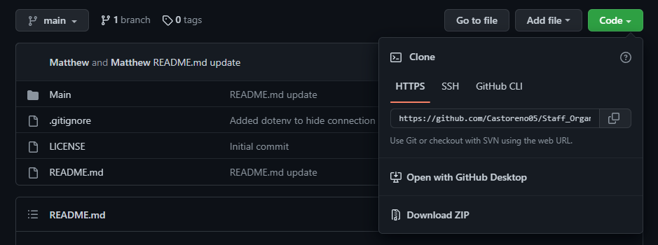

# Staff Organizer

## Description 

In this application you will be interacting with the terminal to view, add or update data that is stored in a database. 

When the commands have been made in the terminal (See [Installation](#installation) on more information on how to install), the 

main menu will apprear. Once a selection has been made the application will either view, add or update the 

database, depending on the selection. Use this application to manipulate the database and keep track of 

employees, managers and their roles.

---

## Demo

User Demonstration

https://user-images.githubusercontent.com/105801681/183331588-908b434c-7623-4c84-98e2-82c073d9a23c.mp4

---

## Installation

(**MUST have MySQL installed before using this application**)

1) Clone Staff Organizer repository 

2) Navigate to 'index.js' located in the 'Main' folder, then open the file.

3) On lines 12 & 15 enter your mysql login information

4) Right click 'index.js', then 'Open in Intergrated Terminal' 

5) Run 'mysql -u root -p' then enter a password if needed

6) While in mysql run the commands 'source db/schema.sql' followed by 'source db/seeds.sql'

 

7) Enter 'Quit' to exit mysql.

8) Run the command 'node index.js'

---

## Tools Used

* Node.js
* NPM
 * MySQL2
 * Inquirer
 * Console.table

 ---

 ## Contact Information

 Matthew Castoreno

 Email: <matthew.castoreno@yahoo.com>

